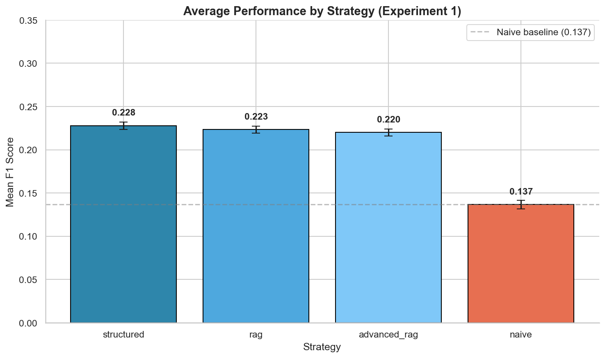

# Context Engineering Experiments

Controlled experiments on a practical question: when models have very large context windows, does it still matter how we package and retrieve information?

The short answer from this study is yes. Naive long-context stuffing underperformed structured context and retrieval-based approaches, especially as context fill and noise increased.

## What This Repo Shows

This project compares four context strategies under controlled fill percentages and pollution levels:

| Strategy | Description |
| --- | --- |
| Naive long context | Concatenate documents into a large prompt with minimal structure. |
| Structured long context | Use the same source material, but add document boundaries, headings, metadata, and a table of contents. |
| Basic RAG | Retrieve a focused set of chunks with lexical search before answering. |
| Advanced RAG | Add hybrid retrieval, reranking, and query decomposition on top of retrieval. |

The goal was not to make a product demo. It was to isolate a design question that affects production AI systems: whether raw context capacity can replace context engineering discipline.

## Key Findings

| Finding | Result | Why It Matters |
| --- | --- | --- |
| Structure beat naive long context | Structured context averaged 0.228 F1 vs. 0.137 for naive, a 67% relative lift. | Even with a large context window, packaging and boundaries materially affect quality. |
| Naive context had a mid-fill collapse | Naive performance dropped sharply around 50% fill before recovering at very high fill. | Fill percentage is an operational variable, not an implementation detail. |
| Basic RAG was a strong baseline | Basic RAG averaged 0.223 F1, close to structured context and slightly ahead of advanced RAG in this corpus. | More complex retrieval should earn its place against simple lexical baselines. |
| Retrieval became essential under extreme pollution | At a 19:1 noise-to-signal ratio, RAG variants more than doubled naive performance. | In noisy enterprise corpora, ignoring irrelevant context is often more important than adding more context. |

These are relative comparisons inside one experimental setup. The absolute F1 scores are low because the tasks are deliberately strict lookup/synthesis questions, so the important signal is the gap between strategies rather than the raw score alone.



## Experimental Design

- **Corpus:** API/model-card documentation plus Gutenberg padding to control context fill and pollution.
- **Questions:** Fixed evaluation set with repeated runs per condition.
- **Controls:** Temperature fixed at 0.0, identical prompts where possible, and contexts padded to specific fill percentages from 10% to 90%.
- **Scale:** 4,380 API calls across the completed study.
- **Experiments:**
  - Experiment 1: needle-in-multiple-haystacks across fill percentages.
  - Experiment 2: context pollution with increasing irrelevant-but-plausible text.
  - Experiment 5: quality, latency, and cost frontier.

## How To Read The Results

Start with:

- `ARTICLE_CONCLUSIONS.md` for the narrative interpretation and result tables.
- `ANALYSIS_CONCLUSIONS.md` for visualization rebuild notes and chart specifications.
- `results/analysis/` for scored outputs and summary metrics.
- `scripts/generate_visualizations.py` for chart generation.
- `exp1_strategy_comparison_fixed.png` for the README chart generated from the rebuilt visualization pass.

## Repo Map

```text
src/
  context_engineering/   # strategy implementations
  data/                  # corpus and chunk helpers
  evaluation/            # scoring and judging
  models/                # Gemini client wrapper
  utils/                 # monitoring, stats, token/rate helpers

scripts/
  run_experiment.py      # unified pilot/experiment runner
  run_experiment_1.py    # fill-percentage experiment
  run_experiment_2.py    # pollution experiment
  analyze_results.py     # result scoring and summaries
  generate_visualizations.py

results/
  analysis/              # scored outputs and summary metrics
```

## Run Locally

```bash
python3 -m venv venv
source venv/bin/activate
pip install -r requirements.txt

cp .env.example .env
# Add GOOGLE_API_KEY to .env for live model calls.
```

Check the environment and plan a run:

```bash
python scripts/estimate_feasibility.py
python scripts/run_experiment.py --experiment pilot --dry-run
```

Run tests:

```bash
pytest tests/
```

Run a bounded experiment sample:

```bash
python scripts/run_experiment.py --experiment exp1 --limit 5 --per-minute-token-limit 240000
```

Full experiment runs require API quota, local corpora, and patience. Use `--dry-run`, `--limit`, and `--per-minute-token-limit` before launching production-scale jobs.

## Engineering Notes

- The runner enforces token-budget controls so large-context jobs do not accidentally exceed API limits.
- Result analysis is separated from generation so failed or partial runs can still be scored.
- Generated outputs and large corpora should stay out of git unless intentionally promoted as public artifacts.
- `.env` is local-only and must never be committed.

## Limitations

- Results are model- and corpus-specific; they should be treated as evidence, not a universal law.
- The benchmark focuses on lookup and synthesis, not open-ended writing or chat.
- Advanced retrieval may outperform basic RAG in domains where lexical matching is weaker.
- Existing visualizations need a final tracked-public-assets pass before the GitHub page should rely on charts.

## Related Writing

- [Context engineering prelude](https://srinidhi.dev/writing/context-engg-prelude/)
- [Experiment conclusions](https://srinidhi.dev/writing/context-engg-conclusions/)

## Author

Srinidhi Ramanujam

Production AI, evaluation, and context engineering

https://srinidhi.dev
